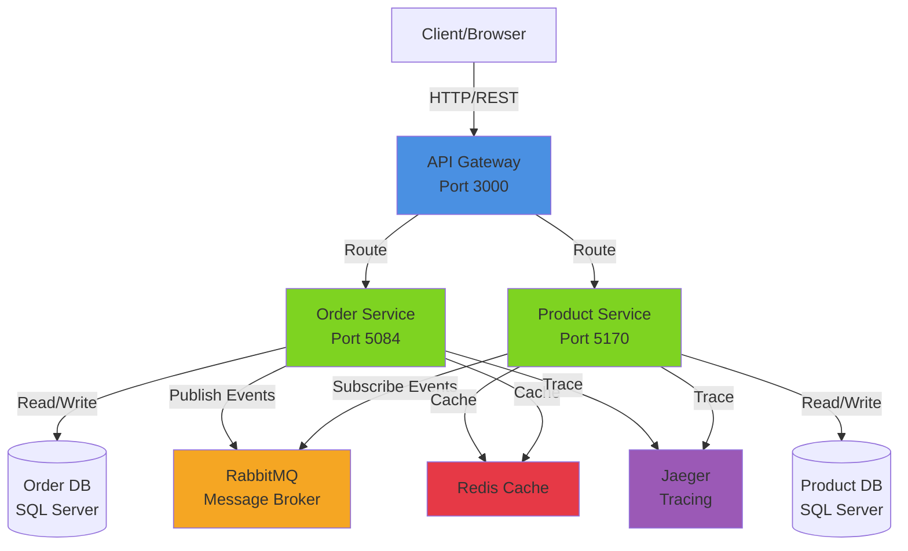
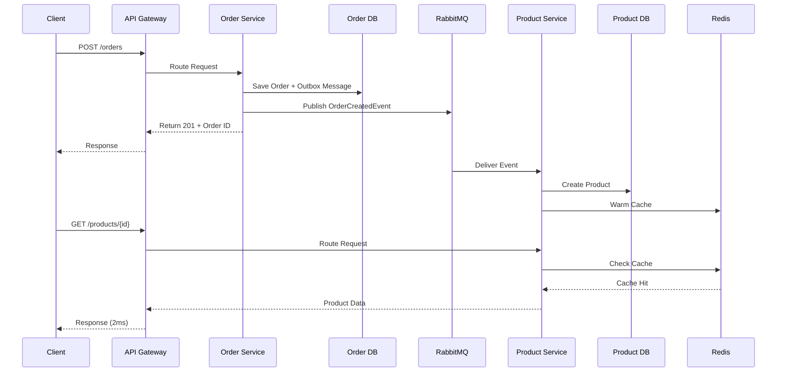

# .NET Microservice Template

A production-ready, highly-opinionated microservice template built with **.NET 10**, following **Clean Architecture** and **Vertical Slice Architecture** principles.

## 🚀 Overview

This repository provides a robust foundation for building scalable microservices with a focus on developer productivity, performance, and reliability. It includes everything you need to start a new project or learn best practices in modern .NET development.

The template ships with an API Gateway, two sample services, shared building blocks, SQL Server, RabbitMQ, Redis, and Jaeger for local end-to-end validation.

## 🌐 Frontend Integration

This backend ecosystem is optimized for our [Angular Project Template](https://github.com/sonnguyen130504/angular-project-template).

- **CORS Policy**: Pre-configured in `BuildingBlocks` and `ApiGateway` to allow `localhost:4000` and `localhost:4200`.
- **Response Format**: All endpoints return `ApiResponse<T>`, matching the frontend's Zod validation schemas.
- **Gateway**: The YARP Gateway (`localhost:3000`) acts as the single point of entry for the UI.

## 🛠 Tech Stack

- **Core**: .NET 10
- **Architecture**: Clean Architecture + Vertical Slice
- **API Gateway**: YARP (Yet Another Reverse Proxy)
- **Messaging**: MassTransit with RabbitMQ
- **Persistence**: EF Core with SQL Server
- **Caching**: Distributed Redis Cache
- **Documentation**: Swagger/OpenAPI with NSwag
- **Resilience**: Polly (Retry, Circuit Breaker)
- **Validation**: FluentValidation
- **Mapping**: Riok.Mapperly (Source-generated, high performance)
- **Containerization**: Docker & Docker Compose

## ✨ Key Features

- **Standardized API Responses**: Every API returns a consistent `ApiResponse<T>` or `PaginatedResult<T>`.
- **Global Error Handling**: Centralized exception handling with specific business error codes.
- **Transactional Outbox**: Reliable messaging using MassTransit's EF Core Outbox pattern.
- **Domain Events**: Automated intra-service communication via entity events.
- **Audit & Soft Delete**: Built-in support for tracking changes and safe deletions.
- **Idempotency**: Protect write operations with the `[Idempotent]` attribute.
- **Rate Limiting**: Integrated policy-based request throttling.

## 🏃 Quick Start (Local Development)

### Prerequisites

- [Docker Desktop](https://www.docker.com/products/docker-desktop/) installed and running.
- [.NET 10 SDK](https://dotnet.microsoft.com/download/dotnet/10.0) (optional if running only in Docker).

### Environment Setup

1. Copy [env.example](env.example) to `.env`.
2. Review the values in `.env` and keep secrets out of git.
3. Use the same values when running locally and in Docker Compose.

### Run with Docker Compose

The easiest way to test the entire ecosystem is using Docker:

```bash
# Clone the repository
git clone https://github.com/your-repo/net-microservice-template.git
cd net-microservice-template

# Start all services
docker compose up -d --build
```

## 🔗 Local Endpoints

| Service                 | URL                                  |
| ----------------------- | ------------------------------------ |
| API Gateway             | http://localhost:3000                |
| Product Service API     | http://localhost:5170                |
| Product Service Swagger | http://localhost:5170/swagger        |
| Order Service API       | http://localhost:5084                |
| Order Service Swagger   | http://localhost:5084/swagger        |
| RabbitMQ Management     | http://localhost:15672 (guest/guest) |
| Jaeger UI               | http://localhost:16686               |

## ✅ Quick Verification

1. Create an order through the gateway and confirm `order-service` logs show the command handled.
2. Open Jaeger and confirm a trace exists for the order request.
3. Fetch the created product twice and confirm `product-service` serves the second read from Redis.
4. Inspect RabbitMQ management UI if you need to verify queue bindings or message flow.

## 📁 Project Structure

```text
src/
├── BuildingBlocks/      # Shared libraries, behaviors, and base classes
├── ApiGateway/          # YARP-based gateway for routing and aggregation
├── ProductService/      # Vertical slice example for product management
└── OrderService/        # Example service showing cross-service communication
```

## 🏗 Architecture



## 📊 Order Creation Flow



## 📜 Best Practices

This template strictly follows the **TicketFlow Backend Best Practices** (included in the `docs` folder). Key highlights:

- **Primary Constructor Records**: Modern C# 12 features for immutability.
- **Slim Controllers**: Only coordinate with MediatR.
- **Database-level Projections**: Optimize performance with IQueryable mapping.
- **Cache-Aside Read Path**: Product reads use Redis and warm the cache on write.
- **Observability**: Distributed tracing is wired to Jaeger for service-to-service visibility.

## 🤝 Contributing

We warmly welcome contributions to this template! Whether it's fixing bugs, improving documentation, or adding new best-practice features, your help is appreciated to make this template even better for the community.

- **Found a bug?** Open an issue.
- **Have a feature idea?** Start a discussion or submit a Pull Request.
- **Want to improve code?** Fork the repository and send us a Pull Request following our code style.

## 📄 License

This project is licensed under the MIT License - see the [LICENSE](LICENSE) file for details.

